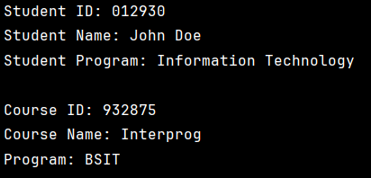

# OOP Enrollment System

---

**Author:** John Doe

**1. Description**: Encapsulation a way to restrict the direct access to some components of an object, so users cannot access state values for all of the variables of a particular object.

Image:
