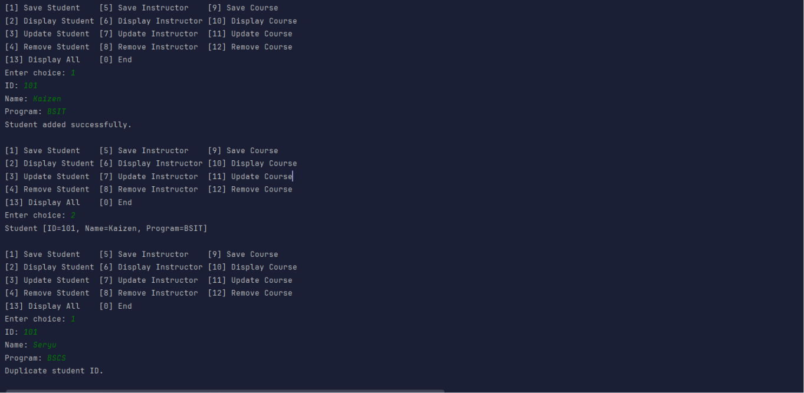
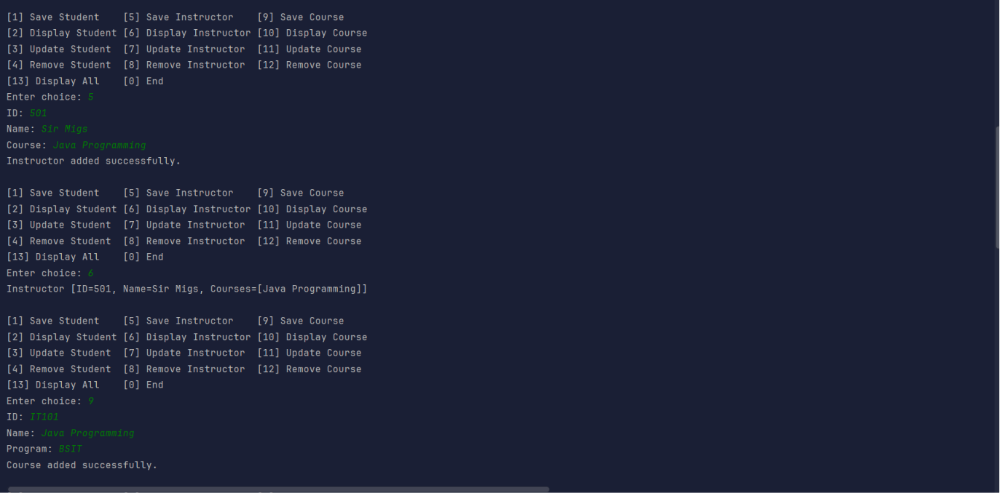
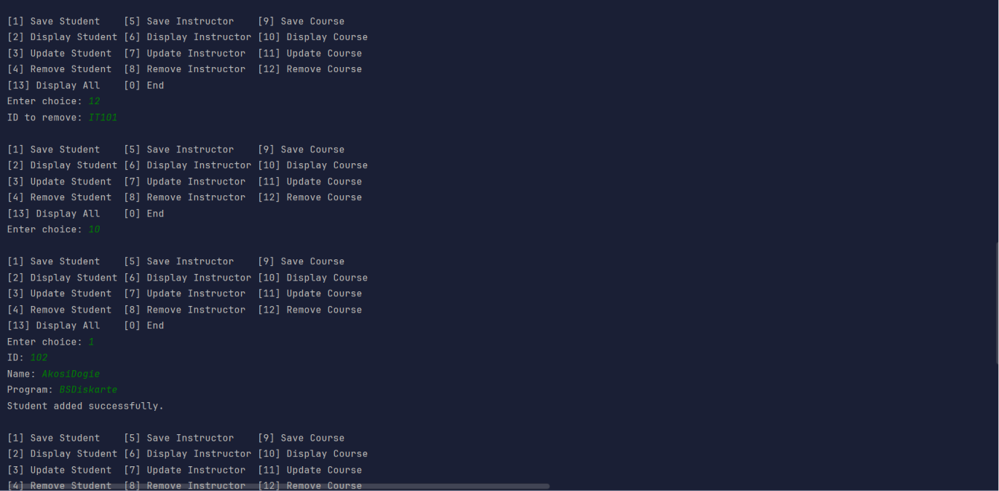
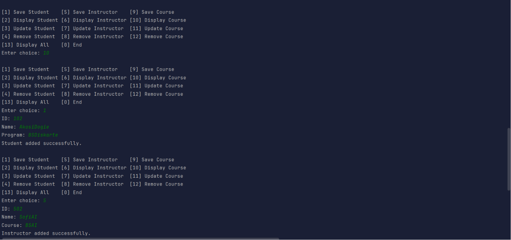
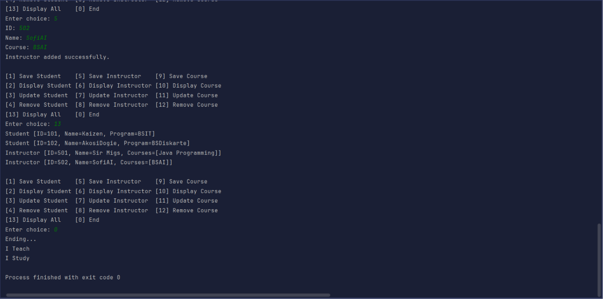

# Enrollment System - Features with Implementations

---

Author: Kiehl Alvarez

---

### 1. See  student appear in the console. System Validation when student ID Duplicates.

### 2. Modify data and handle complex objects(Instructors).

### 3. Removal logic (the index-based loop) works without crashing.

### 4. Display All

### 5. Select [0] to End.

Update:

The system now checks for duplicate IDs and full sections.

Information is saved in lists while the program is running.

Services handle all the work to keep the Main class simple.

Refined the service layer. Added 2 registrations(enrollment and tuition).

Implementations refined my code by transforming abstract "to-do" lists into concrete, executable logic that actually processes data and enforces business rules.