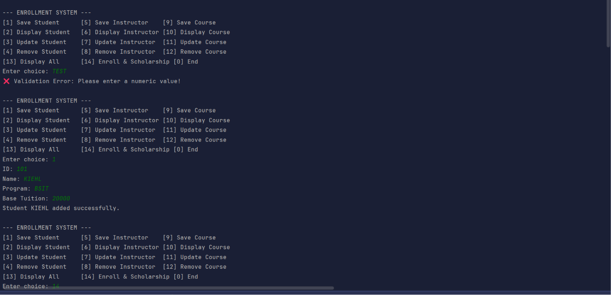
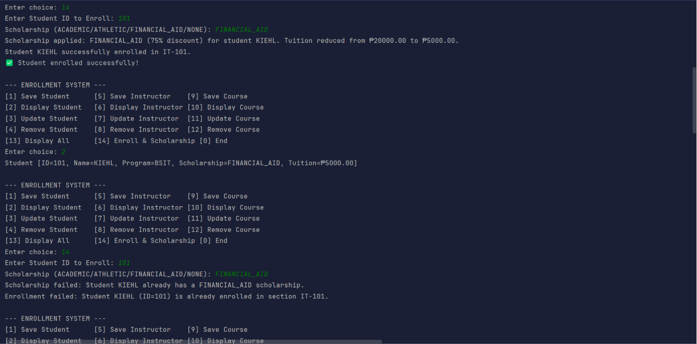
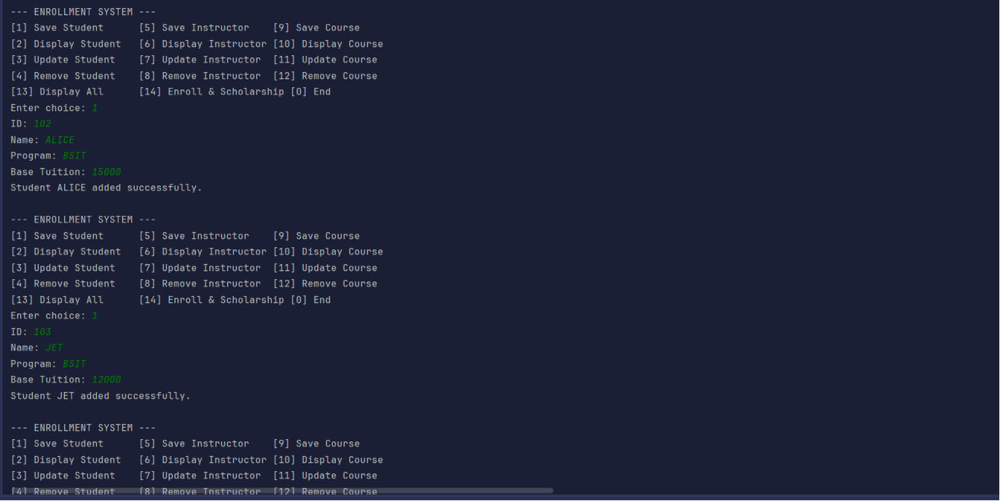
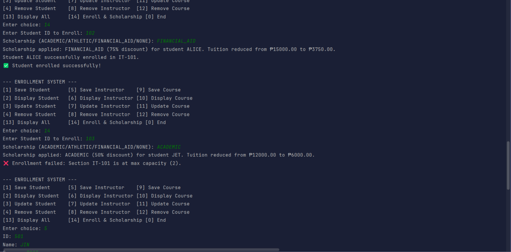
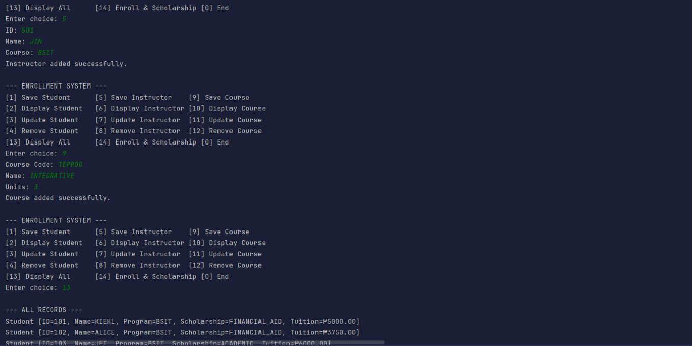
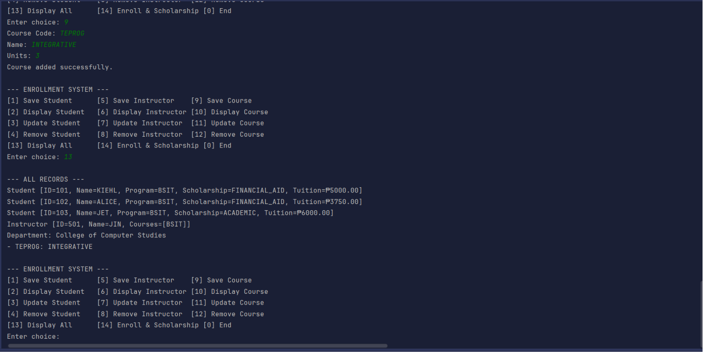

# Enrollment System - Scholarship & Validations

---

Author: Kiehl Alvarez

---

Update Summary:

Replaced manual checks with JUnit assertions to verify scholarship math and enrollment guards.

Verified that SectionFullException triggers a user-friendly error message instead of a system crash.

Confirmed that try-catch blocks effectively manage InputMismatchException during console entry.

Kept the Main class clean by isolating complex enrollment rules inside the EnrollmentRegistration service.

Converted business rules (like "50% off for academics") into executable, tested code.