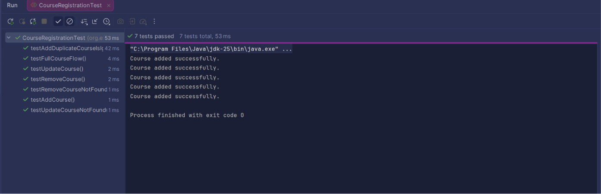
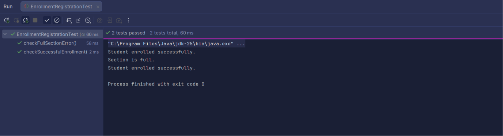
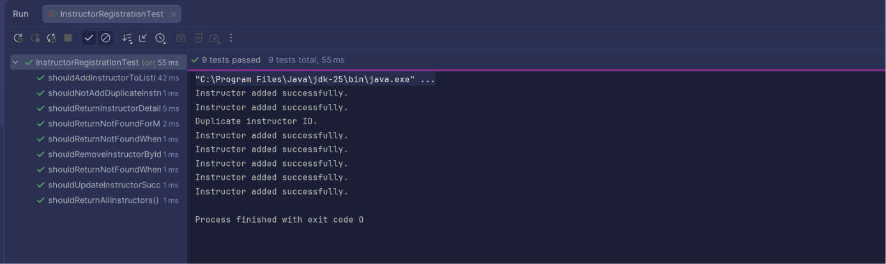
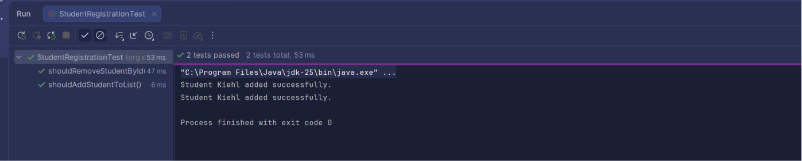
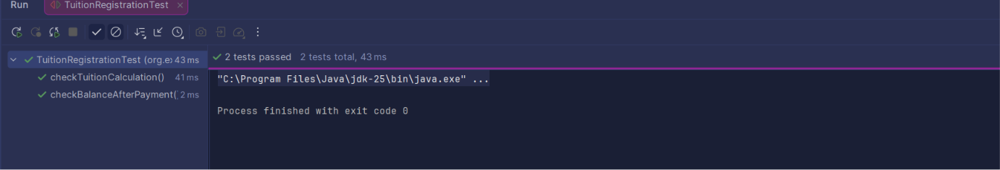

# Enrollment System - JUnit Testing

---

Author: Kiehl Alvarez

---

### 1. Confirms that courses are properly linked to departments and that removal logic operates without errors.

### 2. Ensures the system correctly manages section limits and triggers the SectionFullException when capacity is exceeded.

### 3. Validates the successful handling, modification, and assignment of complex Instructor objects within departments.

### 4. Verifies that student data is added correctly and ensures duplicate IDs are blocked by the system.

### 5. Tests the accuracy of fee calculations based on units and validates the update of remaining balances.

Update:

The system now uses JUnit 5 to automate validation and ensure logic accuracy.

Information is verified in lists through assertions rather than manual console checks.

Services handle all the work to keep the Main class simple and are fully unit-tested.

Refined the service layer. Added automated tests for enrollment and tuition.