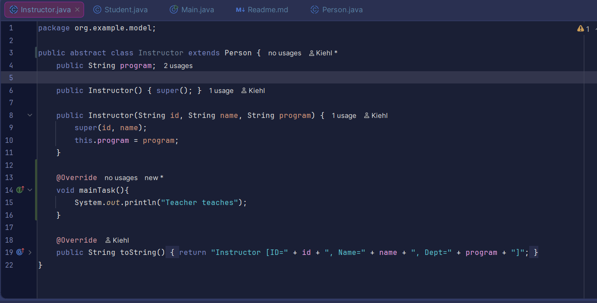
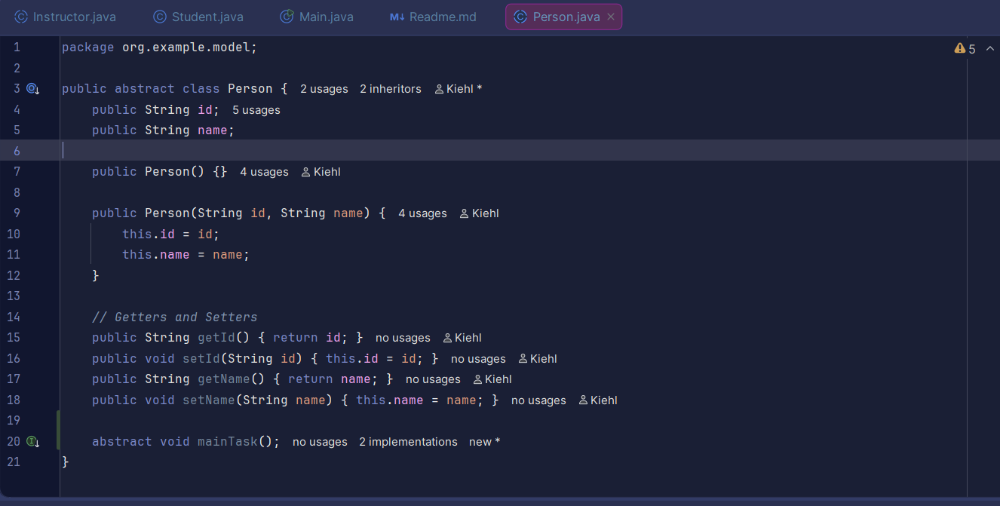
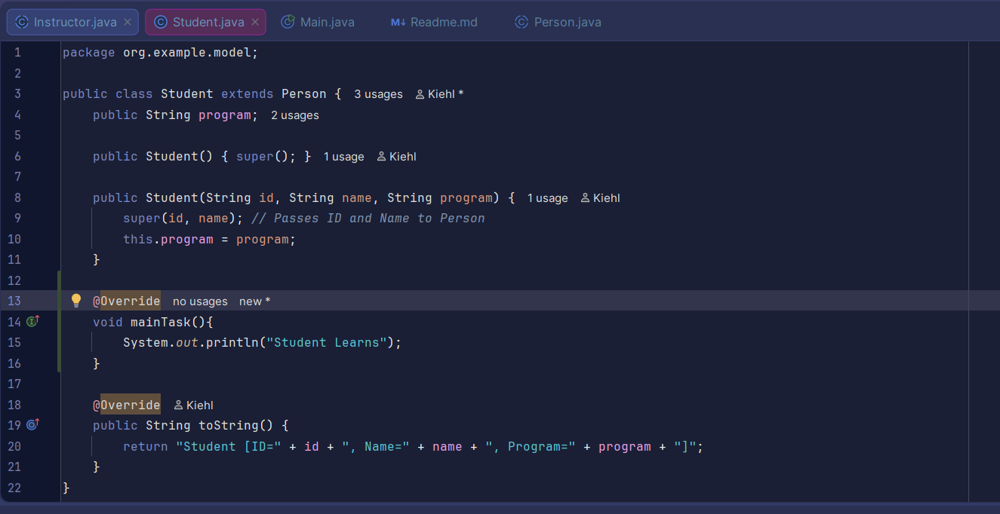

# Abstraction

---

**Author:** Kiehl Alvarez

**Description**:

* Project Structure: Uses an Abstract Person class to share common attributes like names and IDs.

* Inheritance: Student and Instructor inherit these base traits while maintaining their own unique programs.

* Design Benefits: Makes the code significantly cleaner, more organized, and much easier to manage.

* Key Constraint: The Person class is declared with the abstract keyword and cannot be instantiated directly.

